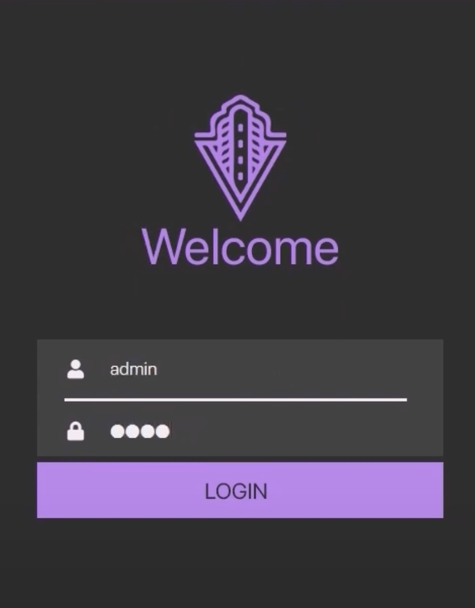
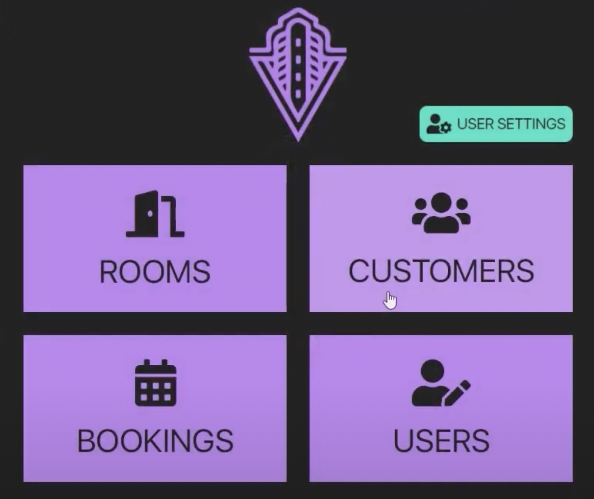

# Hotel Reception Application
 

## Introduction
A multi-platform desktop application designed for use by hotel staff for tasks such as booking of rooms.

This is a project I worked on with 6 other fellow students. We worked with accordance to Scrum
methodology over the course of ~3 months. 

My role was full-stack 
developer including the graphical design of the UI and at times I handled the responsibilities
of Scrum master. 

While this application has some short-comings, I suspect that with some improvements
and feedback from clients, this could be used in real hotels.

## Documentation

[Here](./docs/PRODUCT_BACKLOG.md) is the product backlog (what has been done and what needs to be done).

[Here](./mysql/README.md) is the documentation about how to run the database locally on your computer.

[Here](./javadoc) is the Java class documentation (HTML format).

## Presentation video

## Contributions

All contributions are welcome, just look at the [CONTRIBUTING.md](./CONTRIBUTING.md) file.

Shout-out to:
* Atakan Coban
* Cloé Magnien
* Fabian Dacic
* Hélder Monteiro
* Yuyao Duan
* Oscar Johansson
* Martin Debouté
